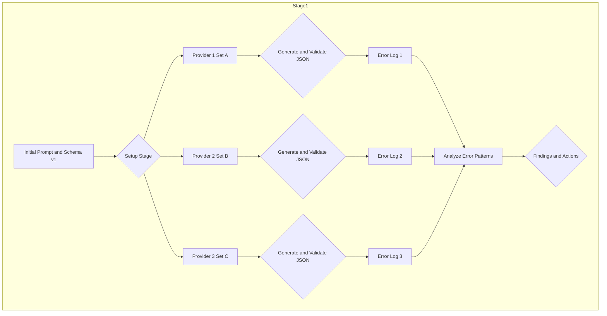
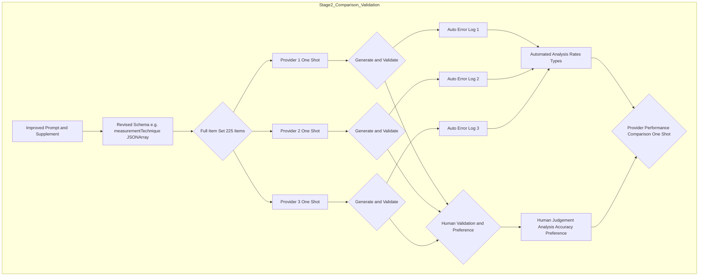

# An iterative journey: Our methodology for comparing LLM performance and developing an AI-assisted workflow for NF Dataset metadata curation

- TODO: Authors
- TODO: Link to GitHub

## 1. Abstract

This document outlines an experiment evaluating Large Language Models (LLMs) from `<REDACTED>, <REDACTED>, and <REDACTED>` for creating standardized "Dataset" metadata records for the Neurofibromatosis (NF) Data Portal. 
While the NF-OSI Processing Initiative established manual curation workflows for a limited number of current studies, a significant backlog of previously released projects lacks this structured metadata due to evolving standards and limited bandwidth. 
Driven by new organizational OKRs and a broader Data Catalog initiative requiring comprehensive metadata, this project explores the feasibility of an **AI-assisted curation workflow** to address this backlog and streamline future data release SOPs. 

We employed a two-stage iterative design: **Stage 1** focused on exploratory analysis using limited datasets to identify common error patterns and inform crucial refinements to both our prompting strategy and the NF Dataset metadata schema itself. 
**Stage 2** entails a comprehensive evaluation using the full dataset, the refined prompt, the revised schema, and detailed human evaluation by NF data managers/curators. 
This human-in-the-loop component, facilitated by a custom side-by-side evaluation application with editing capabilities, includes quantitative scoring, relative performance judgment, and measurement of the effort needed to correct the best LLM output. 
The ultimate goal is to develop and validate an efficient, scalable workflow leveraging LLMs to enhance metadata completeness and consistency across the NF Data Portal.

## 2. Introduction & Background

The Neurofibromatosis (NF) Data Portal serves as a critical resource for the research community, centralizing diverse data types related to NF. 
As part of the NF-OSI Processing Initiative, we published a limited collection of "Dataset" records for newly (re-)processed studies, which involved initial development of the NF Dataset metadata schema and manual curation of the new datasets.

However, the "Dataset" concept was still being formalized, and most studies released prior to 2025 lack this valuable structured metadata. 
This historical backlog represents a significant gap in the comprehensive description of available data. 
Furthermore, new organizational objectives (OKRs) emphasizing data discoverability and the launch of a larger institutional Data Catalog initiative necessitate having complete and consistent metadata, including these standardized Dataset records, for all relevant studies, both past and present.

Addressing this backlog manually poses a considerable challenge due to resource constraints (curator bandwidth). 
Simultaneously, there is a need to streamline the metadata creation process within the standard operating procedure (SOP) for future data releases to make it more efficient and sustainable. 
This context drives the need for exploring advanced technological solutions.

This project investigates the potential of Large Language Models (LLMs) to form the core of a scalable, AI-assisted curation workflow. 
The primary goal is not merely to benchmark different LLMs, but to determine if they can reliably generate high-quality draft NF Dataset using existing study materials (e.g., study abstracts, file annotations, data sharing plans, and other possible sources) and, critically, to understand the nature and extent of human oversight and correction required. 
This experiment, evaluating models from `<REDACTED>, <REDACTED>, and <REDACTED>`, is therefore a foundational step towards designing and validating such a workflow.

An essential component of this work is the deep involvement of our NF data managers and curators. 
**Beyond just evaluating LLM outputs, their participation in the human validation stage is designed to**:

- Develop stronger, shared intuition and agreement on the practical definition of high-quality, useful NF Dataset metadata.
- Identify ambiguities or necessary refinements in the existing NF metadata schema based on real-world curation challenges.
- Compile expert guidance and concrete examples to inform the development of more effective prompts or other improvements for the AI component of the workflow.

This document details our iterative methodology, providing transparency into our process as we work towards an AI-enabled solution for enhancing metadata completeness and consistency on the NF Data Portal.

## 3. Experimental Design: An Iterative Two-Stage Approach

### A. Overall Philosophy:
Our approach is grounded in iterative refinement. 
We believe that understanding why errors occur is as important as measuring error rates. 
Initial, resource-efficient exploration allows us to identify initial feedback points, which then shape a more comprehensive and valid final comparison. 
This includes acknowledging that the initial schema or prompt might be part of the problem, not just the LLM's capabilities.

### B. Stage 1: Initial Exploration, Error Analysis & Refinement (Targeting NF Dataset Schema)

**i. Purpose:**
* Gather preliminary data on error types produced by each LLM when tasked with generating NF Dataset metadata.
* Identify common failure modes regarding adherence to the NF Dataset schema (data types, NF-specific enums).
* Inform development of an improved prompt strategy tailored to NF Dataset creation.
* Critically evaluate the NF Dataset schema's practicality and potential areas for improvement based on LLM extraction challenges.

**ii. Setup:**
* Providers: Three distinct LLM providers, referred to generically as <REDACTED>.
* Data: Limited, non-overlapping subsets of source documents from backlog studies. Each provider received a unique subset.
* Rationale for Subsets: Resource efficiency for initial exploration of generating metadata for diverse backlog studies. Not intended for direct performance comparison.
* Task: Extract structured data from study materials according to the initial version of the NF Dataset schema, using the same baseline prompt.

*   **iii. Process & Analysis:**
    *   *(Existing text - analysis focused on errors specific to generating NF Dataset metadata)*
*   **iv. Key Outcomes & Transition to Stage 2:**
    *   **Common Error Patterns Identified (in NF context):**
        *   *Enum Validation Errors:* Frequent difficulty mapping terms from study descriptions to the official NF controlled vocabularies (e.g., for `measurementTechnique`, `diseaseFocus`).
        *   *Type Mismatches:* Notably, generating lists for `measurementTechnique` vs. the single string required by the initial NF schema version. Other issues with nulls/counts relevant to NF study descriptions.
        *   *Parsing/Formatting Errors:* Including comments impacting JSON validity.
    *   **Action 1: Prompt Refinement:** Developed prompt supplement specifically guiding LLMs on NF schema rules, enum usage, and JSON format.
    *   **Action 2: Schema Revision (`measurementTechnique`):** The consistent list generation for `measurementTechnique` highlighted a limitation in the *NF Dataset schema's* ability to capture multi-technique studies common in NF research. Decision made to revise the NF schema (changing `measurementTechnique` to `JSONArray`) to improve data fidelity and reduce extraction errors, directly informing the target schema for the AI-assisted workflow.

### C. Stage 2: Comparative Performance Evaluation & Human Validation (Simulating AI-Assisted Workflow)

i. Purpose:
- Conduct a robust comparison of LLM performance in generating draft NF Dataset metadata using the refined prompt and revised NF schema.
- Quantify performance using automated metrics and detailed human evaluation by NF data managers/curators.
- Measure the human effort (corrections) required to bring the best LLM-generated draft to acceptable quality.
- Utilize the evaluation process to enhance curator alignment on NF Dataset quality standards and gather feedback for the target AI-assisted workflow and NF schema.

ii. Setup: All <REDACTED> providers, full dataset (222 items representing backlog studies), refined prompt, revised NF schema, one-shot approach.

iii. Process: LLMs generate draft NF Dataset metadata, automated validation against revised schema, systematic human evaluation using the dedicated tool.

iv. Human Evaluation Design:

Purpose: Assess draft metadata quality, judge relative LLM performance, measure correction effort within the NF context, and facilitate curator alignment/feedback for the workflow.
Participants: 5-6 human evaluators (NF staff who wear data manager/curator hats).
Evaluation Tool: Custom research app presenting source document snippets and <REDACTED> provider outputs side-by-side. Includes integrated JSON editor for correcting draft NF Dataset metadata and logging changes.
Data & Batching: 222 backlog items in batches of 10 items (Rationale: Manageable sessions).
Assignment: Unique batch assignment, full coverage. Variable workload (3 eval x 3 batches; 2 eval x 8 batches).

Task per Comparison (within the evaluation app):
1. Review Side-by-Side draft NF Dataset Outputs (A, B, C).
2. Score A, B, C based on human curator preference, which includes accuracy, completeness, and style preferences.
3. Identify highest-scoring draft.
4. (Optional) Using the integrated editor, correct the highest-scoring draft to meet quality standards. (Edits logged.)
6. (Optional) Add comments on rationale, schema issues, or workflow improvement ideas.

### Section 4 - Analysis Plan
* Analysis aims to determine comparative efficiency of LLMs for NF Dataset generation.
* Correction effort measures residual human work needed for NF curation.
* Qualitative analysis captures insights relevant to improving the NF metadata SOP and schema.

### Section 5 - Expected Results & Discussion
* Performance benchmarks for NF Dataset generation.
* Implications for tackling the NF metadata backlog and refining the release SOP.
* Discussion on curator alignment regarding NF metadata quality.
* Actionable recommendations for the NF schema and AI-assisted workflow prompts/design.
* Evaluation of LLMs as partners for NF data managers.
